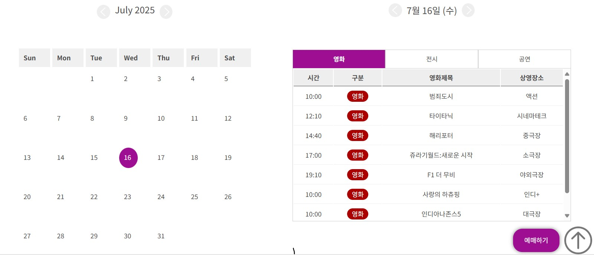

# 🌐 Responsive Web Team Project

> 팀 프로젝트로써 함께 기획·디자인하고 개별 기능을 개발한 **반응형 웹사이트**입니다.  
> 다양한 화면 해상도에서 자연스럽게 동작하도록 반응형 레이아웃을 적용하고,  
> **메뉴 UI, 슬라이더, 탭, 상영일 선택, 달력 기능** 등을 직접 구현했습니다.

---
<br>

## 📆 프로젝트 개요
- **개발 기간:** 2025.07  
- **참여 인원:** 5명 
- **본인 역할:** 메인 페이지 기획, 캘린더, 날짜 선택 UI 등 주요 JS 기능  
- **기획 & 디자인:** 팀 공동 진행 (피그마 작업)
- **배포 링크:** https://Kimseonyoung1002.github.io/responsive_web
- **GitHub Repository:** https://github.com/Kimseonyoung1002/responsive_web

---

<br>

## 📱  주요 기능 (Team Project Features)

| 기능 | 설명 |
|------|------|
| 🎞 반응형 슬라이더 | Swiper.js breakpoints 적용, 각 화면 크기별 슬라이드 개수 변경 |
| 📝 리뷰 toggle | 클릭 시 내용 보이기/숨기기 |
| 📊 탭 전환 | data-target 기반 콘텐츠 전환 |
| 📅 날짜 선택 | 선택된 날짜 하이라이트 + 요일 계산 표시 |
| 📆 달력 월 이동 | 화살표 클릭 시 월 변경 + 상단 날짜 표시 |

---

<br>

## 🛠 기술 스택

### **Frontend**
- HTML  
- CSS  
- JavaScript(ES6)  

### **Libraries / Tools**
- jQuery  
- Swiper.js  
- CSS Media Queries  
- Flexbox / Grid  

---

<br>

## 🗂️ 폴더 구조
```bash
html/
 ┣ css/
 ┃ ┣ img/
 ┃ ┣ footer.css
 ┃ ┣ header.css
 ┃ ┗ main.css
 ┣ js/
 ┃ ┣ header.css
 ┃ ┗ main.css
 ┣ images/
 ┣ sub_page/
 ┃ ┣ css/
 ┃ ┃ ┣ footer.css
 ┃ ┃ ┣ header.css
 ┃ ┃ ┗ main.css
 ┃ ┣ js/
 ┃ ┃ ┣ header.css
 ┃ ┃ ┗ main.css
 ┃ ┣ sub_img/
 ┃ ┗ sub.html
 ┗ index.html
```

---

<br>

## 📌 주요 기능 상세

<br>

🖼️ UI 미리보기
<p align="center"> </p>

<br>

## 1) 날짜 선택 기능

```javascript
const calendarDates = document.querySelectorAll('.calendar .date');
const displayDate = document.querySelector('.date_box div:nth-child(2)');
const year = 2025;
const month = 6;
const days = ['일', '월', '화', '수', '목', '금', '토'];
const defaultDate = 14;

function selectDate(day) {
  calendarDates.forEach(date => date.classList.remove('selected'));

  calendarDates.forEach(date => {
    if (parseInt(date.textContent) === day) {
      date.classList.add('selected');

      const selected = new Date(year, month, day);
      const dayOfWeek = days[selected.getDay()];
      displayDate.textContent = `${month + 1}월 ${day}일 (${dayOfWeek})`;
    }
  });
}

selectDate(defaultDate);

calendarDates.forEach(date =>
  date.addEventListener('click', () => {
    selectDate(parseInt(date.textContent));
  })
);
```

## 2) 달력 월 이동

```javascript
const leftBtn = document.querySelector('.cal_date_box img[alt="왼쪽버튼"]');
const rightBtn = document.querySelector('.cal_date_box img[alt="오른쪽버튼"]');
const monthDisplay = document.querySelector('.cal_date_box .month');

let currentYear = 2025;
let currentMonth = 6;

function showMonth() {
  const monthNames = [
    "January","February","March","April","May","June",
    "July","August","September","October","November","December"
  ];
  monthDisplay.textContent = `${monthNames[currentMonth]} ${currentYear}`;
}

leftBtn.addEventListener('click', () => {
  currentMonth--;
  if (currentMonth < 0) {
    currentMonth = 11;
    currentYear--;
  }
  showMonth();
});

rightBtn.addEventListener('click', () => {
  currentMonth++;
  if (currentMonth > 11) {
    currentMonth = 0;
    currentYear++;
  }
  showMonth();
});
